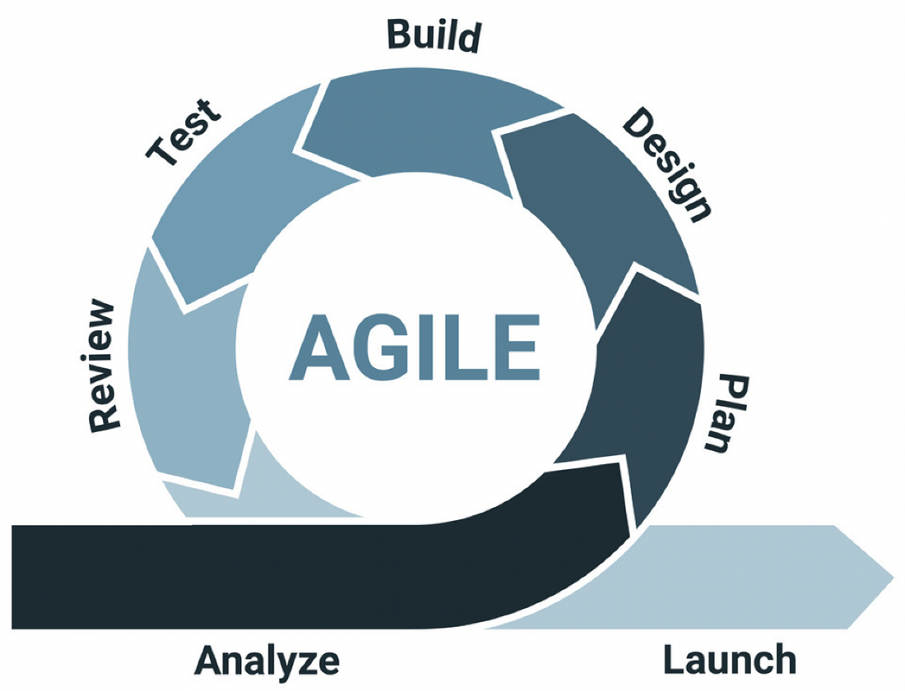

# Chameleon Website

This folder contains the Software Requirements Specification (SRS) documents and relevant material for students within the Chameleon Website Project.

## Project Information

### Client/Product Owner (T1 2022)

The Chamelion company board is the owner of the Chamelion Website and decided on the requirements and functionalities to include.
During T1 2022, the board director was Valeh Moghaddam (Lecturer, Internet of Things)

### Project Team (T1 2022)

* **Project Leader**: Nabil Francis
* **Assistand Project Leader**: Nykolai Mcherron
* **Design Team Leader**: Ayushi Natalie Alujjage
* **Web Dev Team Leader**: Ruwanganath Ramanayake
* **Web Design Team**
  * Karanbir Singh Bhatti
  * Nathan Cahill
  * Nikhil Nikhil
  * Paulina Katarzyna Wesolowska
  * Sangjun Kim
  * Tejal Girish Ranade
  * Uchechukwu Ajoku
  * Yinfei Zhou
  * Zhenyu Ye
* **Web Dev Team**
  * Bhavishya Pun
  * Dasun Kodikara M
  * Jack Hagen
  * Julian Ryan
  * Kong Chenyu
  * Lachlan James Exton
  * Shakwat Hossein Limon
  * Surpeet Singh
  * Wensong Jing
  * Xinyu Ji

## Project Overview

Like any other company, the Chameleon company requires a website to be its digital public facing space. The main goal of the website is to promote Chameleon’s projects, products, and the services that it provides. As the project implementation progresses additional features and functionalities will be added such as blogs, events calendar, and a clients’ area.

The Chameleon website doesn't have at the moment a dedicated domain name. It is assigned a random URL whenever the pipeline runs after each checkin. At the end of T1 2022, the website is reachable on [https://chameleon-client.mybluemix.net/](https://chameleon-client.mybluemix.net/)

## Software Requirement Specification (SRS)

The Web Dev team has built a [Software Requirement Specification](handover/SRS-Chameleon-WebsiteV1.0.docx)  document based on the initial requirements that were collected from:

* Initial set of requirements from the company board
* Ideation workshop of all the project students

The Web Design team has provided the necessary web font, colours and layouts that the web dev team used in the SRS and then built into the website.

## Tech Stack

### Software

* Google App Engine or Cloud foundry in IBM Cloud for hosting
* Google Cloudbuild or IBM Cloud Toolchain for DevOps
* MongoDB is the database and MongoDB compass for development
* Vue JS – JavaScript framework (Front end)
* Bootstrap – UI CSS framework (Front end)
* NodeJS – Back JavaScript runtime
* Express – Server Management for backend APIs
* In most Windows versions, Linux versions, Mac OS or OS X edition as operating systems

### Web browsers supported

* Chrome
* Safari
* Opera
* Firefox
* Microsoft Edge
* Most modern browsers which supports HTML/JS.CSS

### Hardware

* A computer system capable of running any major web application
* An internet connection to allow the client access to the website

## Tasks management

[Trello](https://trello.com/b/wbieC0bc/chameleon-website) is the tool used to manage the tasks backlog, planning and assignments.

## Online Services and accounts

Several online services were used as part of the Chameleon Website project.
A dedicated email address (chameleon@deakin.edu.au) has been used to access the various online tools. A handful of the project leaders should have access to this account. **Please contact the [SIT Capstone team](mailto:sit-capstone-support@deakin.edu.au) to request access to this email account**

* Github repositories
  * Backend: https://github.com/Chameleon-company/chameleon-website-webdev-server
  * Frontend: https://github.com/Chameleon-company/chameleon-website-webdev-client

* Mongodb
  * Database: https://account.mongodb.com/account/login
  * Username: chameleon@deakin.edu.au
  * Password: Contact Nabil Francis or Ruwanganath Ramanayake

* IBM Cloud (A temporary service to build the pipeline in T1 2022. It should be moved to Deakin GCP account). To handover this account to the T2 2022, please contact Ruwanganath Ramanayake
  * IBM Account: https://cloud.ibm.com/catalog

## Product Development Life Cycle
The steps involved in the product development lifecycle for our team are as follows:

* We engage with the client (in our case is the company board) and establish one or more user stories.
*	Once we have the user story, we create one or more tasks associated with delivering the technical component of the user story. This task is then assigned to one of the team members.
*	The team member creates a feature branch for this particular task (named according to the task name). They then complete that work and once the work is done, create a pull request associated with that branch.
*	The pull request is then reviewed by a senior team member. Feedback is provided if needed, or if it is of a high enough quality, it is approved and then merged into the master branch. This automatically triggers the build and deployment pipeline, which deploys the updated version to the live (public) application, including any database migrations.
*	Once this has been deployed, it is then tested by another team member and if it passes testing, it is marked as done.

Ultimately, we then review the functionality delivered against the user story first and then with the client in order to identify any gaps or iterations that need to be made. The diagram below shows the iterative process that we follow to deliver on the user stories.

### New Tasks

As per the above SDLC, new tasks are created based on the user stories that are defined in consultation with the client. The first step is that we identify the user story, and then we define the tasks that are required to be delivered as part of delivering the user story. 
Initially, all tasks and user stories start off in the backlog. At the beginning of each sprint / iteration, we then identify which items from the backlog are able to be assigned and worked on for the next sprint. These then follow the SDLC defined above.

### Definition of Done

A task is done when the following conditions have been met:

* The code has been created in its own branch and submitted for review via pull request. The code should be of a standard (https://airbnb.io/javascript/react/).
* The code has been reviewed and approved by a senior member and merged into the master branch.
* The updated application has been deployed and then tested and assessed by another team member.
* The user story has been reviewed and confirmed as working by the client.

### Task Review

There are three elements of the task review process:

* The code is reviewed by a senior team member and only then, merged into the master branch.
* Once the code has been automatically built and deployed to the cloud hosted version, it is tested by another team member in order to validate it at a QA level.
* Once this is done, we will review the functionality vs the original user story with the client.

Note that in order for the above process to work, we need to work on the same base repository, not separate forks.

### Testing

In order to complete testing, the website is first deployed automatically via our pipeline into the cloud environment. Once this is done, the task needs to be tested against the technical requirements initially by another team member (someone other than the developer). Once it has been tested and passed by that team member, the functionality is reviewed against the user story with the client.

### Branching Strategy

For each task that is created, the developer will do the following:

* A new feature branch will be created.
* All development work will be done on that branch.
* Once complete, a pull request will be created and then reviewed by one of the senior developers.
* The senior developer will then review the code and if appropriate, it will be merged into the main code base.
* Once this is done, this will trigger the DevOps pipeline, which will automatically deploy the latest website version.
* Once this is done, the ticket can be tested and then demonstrated to the client for additional feedback.

In terms of rules for bitbucket, all development must be done on a feature branch and must be merged into the master only once it has been reviewed and approved by a senior developer.

For future teams, this is a good reference for how to use feature branches:

https://www.atlassian.com/git/tutorials/comparing-workflows/feature-branch-workflow